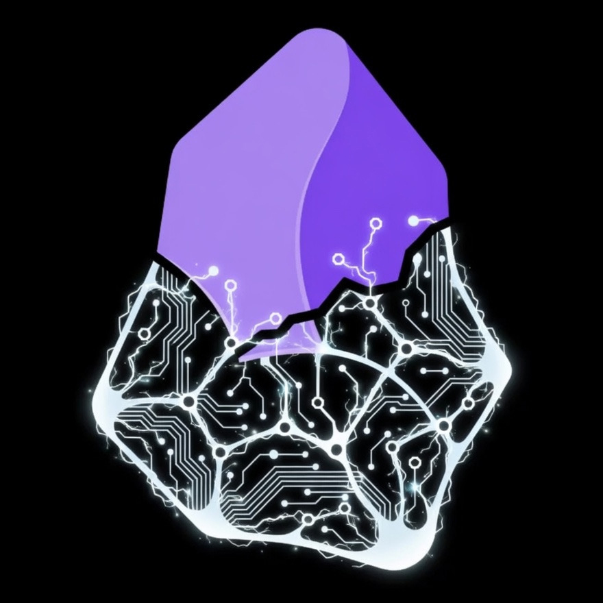

# MYCELIUM

<div align="right">

[](README.md)
[](README.ru.md)

</div>

<p align="center">
  
</p>

Представь: каждый разговор с AI-агентом начинается не с чистого листа — а с полным пониманием того, кто ты, что ты знаешь, над чем работаешь и что для тебя важно. Ты загружаешь документы, заметки, статьи, разговоры. Система извлекает структурированное знание, связывает факты между собой, хранит всё локально на твоей машине. Агент читает этот граф как родной язык: находит контекст, обнаруживает связи, персонализирует каждый ответ.

Каждый neuron и synapse встроен в общее семантическое пространство — векторы, где близость определяется смыслом, а не словами. В сочетании с граф-архитектурой это позволяет MYCELIUM находить не только то, что ты явно сохранил, но и то, что с этим связано, что из этого следует, и какие скрытые паттерны проявляются во всей сети знаний.

MYCELIUM не просто хранит — он рассуждает. Система обнаруживает неочевидные связи между далёкими концепциями, автоматически кластеризует знания по темам и находит пробелы и противоречия в твоём мышлении. Чем больше ты используешь систему, тем точнее её модель тебя.

Как грибной мицелий, пронизывающий деревья сквозь почву — распределяя питательные вещества, распространяя signals, обеспечивая коллективный отклик — MYCELIUM создаёт **Mind Wide Web**: знание, которое накапливается со временем, затухает при отсутствии обращений, крепнет от повторений и поднимает на поверхность свежее и актуальное.

**Что ты получаешь:**
- **Гибридный поиск** — векторное сходство + ключевые слова + обход графа, слитые воедино
- **Временной интеллект** — результаты с учётом затухания: свежее и подтверждённое всплывает, устаревшее уходит
- **Эмерджентные инсайты** — вывод между neurons находит связи, которые ты не формулировал явно
- **Схожесть файлов** — ссылки на основе embeddings между файлами vault, видимые в графе Obsidian
- **Адаптивные домены** — обучи систему обрабатывать финансы, заметки к книгам или любую область знаний с помощью кастомных blueprints
- **Рабочее пространство агента** — постоянная директория `_AGENT/` с авто-генерируемым контекстом графа, curated memory и ежедневными логами
- **Локальный суверенитет** — твоя машина, твои данные, твой Neo4j. Никакой облачной зависимости.

---

## Содержание

- [Как это работает](#как-это-работает)
- [Быстрый старт](#быстрый-старт)
- [Первые 5 минут](#первые-5-минут)
- [Skills](#skills-claude-code)
- [MCP Tools](#mcp-tools)
- [Домены знаний](#домены-знаний)
- [Визуализация](#визуализация)
- [Архитектура](#архитектура)
- [Конфигурация](#конфигурация)
- [Makefile](#makefile)

---

## Как это работает

```
Text / Files / URLs                     AI Agent (Claude Code)
       ↓                                        ↑
   Signal (raw input)                    MCP tools
       ↓                                        ↑
   LLM extraction ──→ Neurons + Synapses ──→ Hybrid Search
                       (entities)  (facts)   (vector + BM25 + graph)
```

**Три слоя знаний:**

| Слой | Что хранит | Пример |
|------|-----------|--------|
| **Signal** | Сырой ввод, сохраняется как есть | Текст, PDF, разговор |
| **Neuron** | Извлечённая сущность: человек, концепция, навык, событие | `"Rust"` (skill), `"Alice"` (person) |
| **Synapse** | Семантическая связь между neurons | `"Alice knows Rust since 2024"` |

**Память, которая дышит.** Знание не статично — оно стареет. Neurons, к которым ты возвращаешься, становятся сильнее; те, что ты игнорируешь, постепенно угасают. Математика:

```
weight = confidence × e^(−decay_rate × days_since_last_mention)
```

Повторные подтверждения снижают decay_rate. Свежее + уверенное = всплывает первым. Ничто не удаляется жёстко — знание просто угасает, пока не будет подтверждено снова.

---

## Быстрый старт

**Предварительные требования:** Docker + Docker Compose, Python >= 3.12 + [uv](https://docs.astral.sh/uv/), [Claude Code](https://docs.anthropic.com/en/docs/claude-code) CLI.

```bash
git clone <repo-url> && cd mycelium
bash scripts/install.sh   # интерактивно: выбирает сценарий, настраивает .env, устанавливает MCP
```

Удалить всё позже: `bash scripts/uninstall.sh`

Установщик проведёт через 3 сценария:

| Сценарий | Embeddings | Лучше для |
|----------|------------|-----------|
| **1. Локальная разработка** (`make quickstart`) | DeepInfra API | Разработка, эксперименты (MCP via stdio) |
| **2. Docker + API** (`make quickstart-app`) | DeepInfra API | Деплой без локального Python (MCP via HTTP) |
| **3. Full Docker** (`make quickstart-docker`) | Локальный BGE-M3 (~2 GB) | Изолированная среда, без внешних API (MCP via HTTP) |

Или вручную (сценарий 1): `cp .env.example .env && make quickstart`

После установки MCP tools MYCELIUM доступны в Claude Code из любой директории.

> **Docker:** LLM-инструменты извлечения (`add_signal`, `re_extract`, `rethink_neuron`) требуют `claude` CLI, недоступного внутри Docker. Используй `ingest_direct` / `ingest_batch` для Docker-деплоя.

---

## Первые 5 минут

После установки, в Claude Code:

```
# Включить запись
/mycelium-on

# Загрузить файл — граф инициализируется с ~30–50 neurons
/mycelium-ingest ~/Documents/my_notes.md

# Задать вопрос по всему загруженному
/mycelium-recall "what are my main interests?"

# Посмотреть здоровье графа: сильнейшие знания, что угасает, пробелы
/mycelium-reflect
```

---

## Skills (Claude Code)

Slash-команды, оборачивающие типовые сценарии. Доступны из любой директории в Claude Code.

**Управление доступом**

| Skill | Что делает |
|-------|-----------|
| `/mycelium-on` | Включить чтение + запись |
| `/mycelium-off` | Отключить весь доступ |

**Работа с графом**

`/mycelium-ingest <path>` — Полный workflow загрузки: сохраняет файл в vault → читает контекст графа (избегает дублей) → автоопределяет домен → извлекает neurons и synapses через LLM → связывает межсекционные связи → записывает Obsidian frontmatter. Возвращает signal UUIDs, количество созданных/слитых neurons и synapses.

`/mycelium-recall <query>` — Гибридный поиск + синтез: запускает vector + BM25 + обход графа → получает полный контекст neuron → синтезирует ответ → цитирует источники с провенансом.

**Обслуживание**

`/mycelium-reflect` — Снапшот здоровья графа: сильнейшие знания по весу, угасающие знания, распределение по типам, пробелы и конкретные рекомендации по обогащению или очистке.

`/mycelium-distill` — Сеанс очистки (макс. 10 действий): сливает почти-дублирующиеся neurons, переосмысляет слабые neurons через LLM, помечает сироты для удаления. Запускает `sleep_report` до и после для проверки улучшений.

`/mycelium-discover` — Поиск паттернов (неразрушающий, макс. 10 выводов): кластеризует neurons по темам через алгоритм Louvain, выводит скрытые межкластерные связи, обнаруживает пробелы и противоречия. Только добавляет, никогда не удаляет.

**Настройка**

`/mycelium-domain [name]` — Интерактивный конструктор домена: задаёт уточняющие вопросы → генерирует blueprint YAML (vault prefix, triggers, extraction focus, tracking fields) → создаёт его в `~/.mycelium/domains/`. При следующем ingest совпадающие файлы автоматически используют правила извлечения домена.

---

## MCP Tools

Полные возможности, доступные через [MCP](https://modelcontextprotocol.io). Вызывай напрямую из Claude Code или любого MCP-совместимого клиента.

<details>
<summary>Загрузка</summary>

| Tool | Описание |
|------|---------|
| `add_signal` | Загрузить текст/файл/URL, извлечь знания (поддерживает `async_mode`) |
| `ingest_direct` | Загрузить предварительно извлечённые neurons и synapses |
| `ingest_batch` | Пакетная загрузка нескольких объектов с общей дедупликацией |

</details>

<details>
<summary>Граф знаний</summary>

| Tool | Описание |
|------|---------|
| `add_neuron` | Создать neuron вручную |
| `get_neuron` | Получить neuron по UUID с synapses и историей |
| `list_neurons` | Список neurons с фильтрами (тип, имя, сортировка, лимит) |
| `update_neuron` | Обновить поля neuron |
| `delete_neuron` | Мягкое удаление neuron и его synapses |
| `merge_neurons` | Слить два neurons в один, перепривязав все synapses |
| `rethink_neuron` | LLM переанализирует neuron с полным контекстом, переписывает summary |
| `add_synapse` | Создать synapse между neurons |
| `delete_synapse` | Мягкое удаление synapse |
| `add_mention` | Зафиксировать упоминание neuron в signal |

</details>

<details>
<summary>Поиск и доступ</summary>

| Tool | Описание |
|------|---------|
| `search` | Гибридный поиск: vector + BM25 + обход графа. Префиксы: `lex:` `vec:` `hyde:` `vec+lex:` |
| `get_signal` | Получить signal по UUID |
| `get_signals` | Список signals с фильтром по статусу |
| `get_timeline` | Получить временную историю neuron |
| `re_extract` | Повторно запустить извлечение на signal |

</details>

<details>
<summary>Аналитика</summary>

| Tool | Описание |
|------|---------|
| `detect_communities` | Автоматически кластеризовать neurons по тематическим группам через Louvain |
| `sleep_report` | Анализ здоровья графа: слабые neurons, почти-дубли, устаревшие данные, пробелы |
| `health` | Быстрая статистика системы: количество neurons/synapses, статус Neo4j |

</details>

<details>
<summary>Vault & Obsidian</summary>

| Tool | Описание |
|------|---------|
| `vault_store` | Сохранить файл в vault (SHA-256 адресация, `cortex/` по умолчанию) |
| `vault_link` | Привязать файл vault к его signal + добавить Obsidian frontmatter |
| `obsidian_sync` | Синхронизировать все файлы vault: связи, ссылки схожести, определение перемещений, контекст агента. Используй `ingest=true` для авто-загрузки неиндексированных файлов |

</details>

<details>
<summary>Портативность</summary>

| Tool | Описание |
|------|---------|
| `export_subgraph` | Экспортировать neurons + synapses + signals как JSON |
| `import_subgraph` | Импортировать JSON subgraph (повторно встраивает, если модель отличается) |

</details>

<details>
<summary>Система</summary>

| Tool | Описание |
|------|---------|
| `set_owner` / `get_owner` | Управление идентификатором владельца |
| `save_extraction_skill` / `list_extraction_skills` | Переиспользуемые шаблоны паттернов извлечения |
| `list_domains` / `get_domain` | Просмотр domain blueprints |
| `create_domain` / `update_domain` / `delete_domain` | Управление доменами знаний |

</details>

**Управление доступом** — инструменты доступны через файловые флаги в `~/.mycelium/`:
- `.read_enabled` — инструменты чтения работают (по умолчанию: ВКЛ)
- `.write_enabled` — инструменты записи работают (по умолчанию: ВЫКЛ)

Переключение: `/mycelium-on`, `/mycelium-off`.

---

## Домены знаний

Домены обучают MYCELIUM читать специализированную область знаний. Каждый blueprint определяет:
- **Triggers** — ключевые слова для автоопределения при ingest
- **Vault prefix** — где хранятся файлы этого типа
- **Anchor neuron** — узловой neuron, связывающий все знания домена
- **Extraction focus** — предметный промпт для LLM
- **Tracking fields** — атрибуты для измерения со временем (обеспечивает обнаружение трендов)

Пример — домен исследований и статей:

```yaml
name: research
vault_prefix: reading/research/
triggers: ["abstract", "doi", "arxiv", "references", "methodology"]
anchor_neuron: "Research"
extraction:
  focus: "ключевые аргументы, концепции, авторы, методологии, открытые вопросы"
  neuron_types: ["concept", "person", "belief", "project"]
tracking:
  fields: ["title", "author", "year", "field"]
  analysis: "повторяющиеся темы, концептуальные мосты между статьями"
```

Создать интерактивно: `/mycelium-domain research`

При следующем `/mycelium-ingest` для любого подходящего файла: домен автоопределяется по triggers, применяются правила извлечения, файл попадает в `reading/research/`, а извлечённые neurons привязываются к anchor. Концепции из разных статей соединяются автоматически — идея из статьи 2019 года может всплыть как связь с твоим текущим проектом.

---

## Визуализация

Два взаимодополняющих способа исследовать граф знаний:

**Obsidian** (основной) — открой `~/.mycelium/vault/` как Obsidian vault. Файлы получают YAML frontmatter с `mycelium_related` (ссылки через общие neurons) и `mycelium_similar` (ссылки по embedding-схожести). Используй Obsidian Graph View для визуального исследования. Включить проекцию neurons: `MYCELIUM_OBSIDIAN__PROJECT_NEURONS=true`, затем запустить `obsidian_sync`. Перемещения файлов автоопределяются по хешу содержимого — реорганизуй свободно, не теряя связей.

**Sigma.js** (опционально) — интерактивный браузерный просмотрщик графа с физикой ForceAtlas2, узлами с цветовой кодировкой по типу (палитра Catppuccin Mocha), поиском, всплывающими подсказками и элементами управления размером рёбер/узлов/подписей. Включить: `MYCELIUM_RENDER__ENABLED=true`, затем `mycelium render` или `make render`. Открывается по адресу `http://localhost:8500`.

---

## Архитектура

```
┌─ Local Node (Self-Sovereign) ──────────────────────────┐
│  Neo4j >= 5.18     — graph + vector indices (unified)  │
│  BGE-M3 / API      — embeddings (1024-dim, pluggable)  │
│  Claude Code CLI   — extraction + analysis (LLM)       │
│  MCP Server        — interface for AI agents           │
│  Vault + Obsidian  — file storage (cortex/) + graph viz │
│  Agent Workspace   — _AGENT/ context, memory, logs     │
│  Sigma.js (opt)    — interactive graph viewer :8500    │
└────────────────────────────────────────────────────────┘
```

### Поисковый pipeline

```
Query → [vector name] [vector summary] [BM25] [vector synapse] [BM25 synapse]
                              ↓
                    RRF fusion (reciprocal rank)
                              ↓
                    Decay-weighted reranking
                              ↓
                    Optional: MMR diversity / cross-encoder / node distance
                              ↓
                    Position-aware blending → Results
```

Поддерживает префиксы запросов: `lex:` (ключевые слова), `vec:` (семантический), `hyde:` (гипотетический документ).

---

## Конфигурация

Вся конфигурация через переменные окружения или файл `.env`. Полный список с комментариями — в `.env.example`.

Ключевые переменные:

| Переменная | По умолчанию | Описание |
|-----------|-------------|---------|
| `MYCELIUM_SEMANTIC__PROVIDER` | `api` | Embeddings: `api` (DeepInfra) или `local` (BGE-M3) |
| `MYCELIUM_SEMANTIC__API_KEY` | — | API-ключ DeepInfra |
| `MYCELIUM_LLM__MODEL` | `sonnet` | LLM для извлечения: `sonnet` / `haiku` / `opus` |
| `MYCELIUM_OWNER__NAME` | — | Твоё имя (для связывания от первого лица) |
| `MYCELIUM_RENDER__ENABLED` | `false` | Включить Sigma.js просмотрщик графа (`:8500`) |
| `MYCELIUM_MCP__TRANSPORT` | `stdio` | `stdio` или `streamable-http` |

> **HTTP транспорт:** Сценарии 2 и 3 запускают MCP через HTTP (порт 8000). Регистрация вручную: `claude mcp add -t http -s user mycelium http://localhost:8000/mcp`

---

## Makefile

| Target | Описание |
|--------|---------|
| `make quickstart` | Полная локальная установка (Neo4j + зависимости + индексы + MCP) |
| `make quickstart-app` | Docker-установка с API embeddings |
| `make quickstart-docker` | Полная Docker-установка с локальными embeddings |
| `make up` / `make down` | Запустить / остановить Neo4j |
| `make reset` | Стереть данные Neo4j и перезапустить |
| `make uninstall` | Удалить всё |

---

## Лицензия

[MIT](LICENSE)
